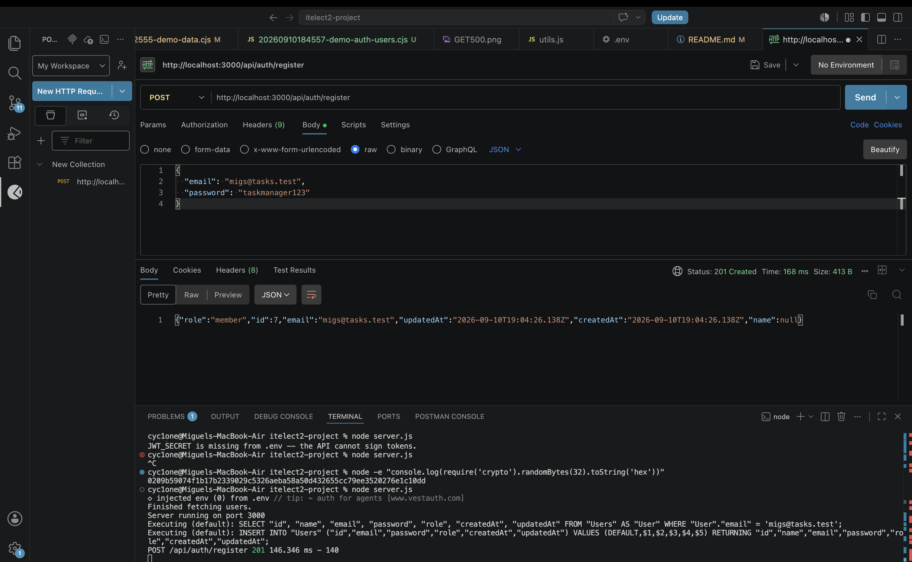
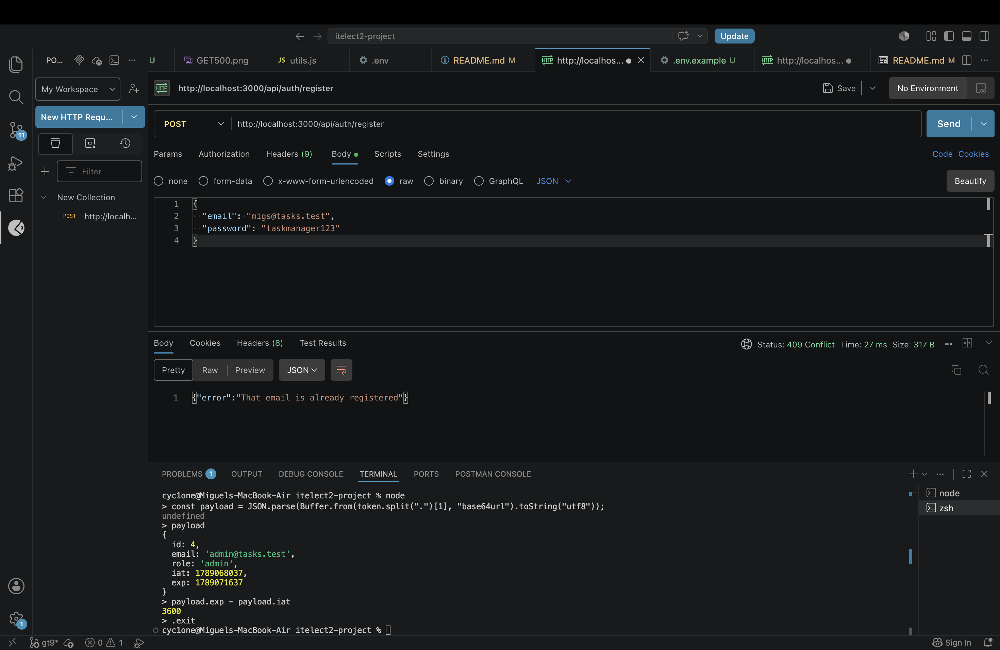
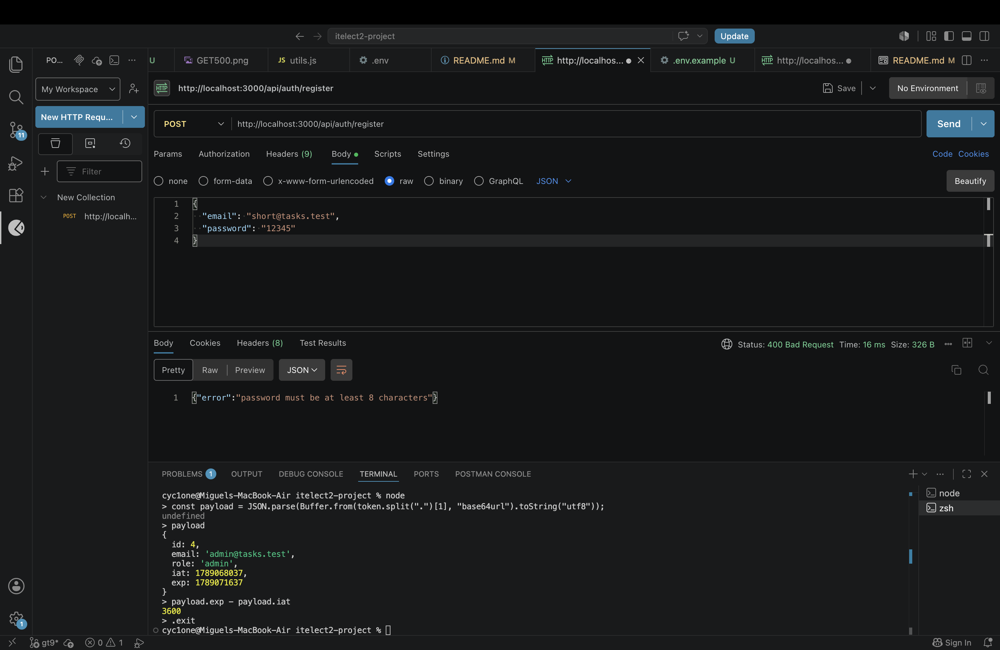
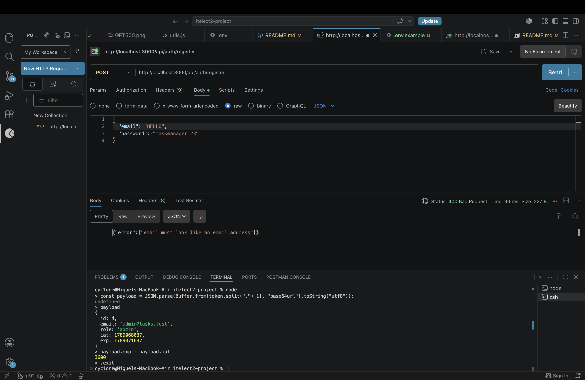
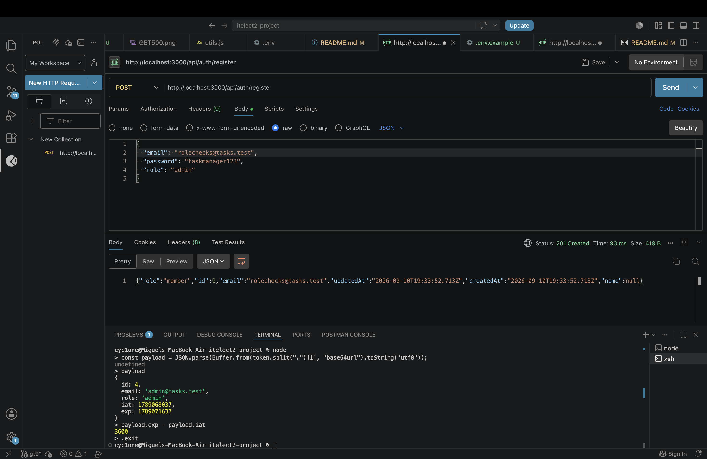
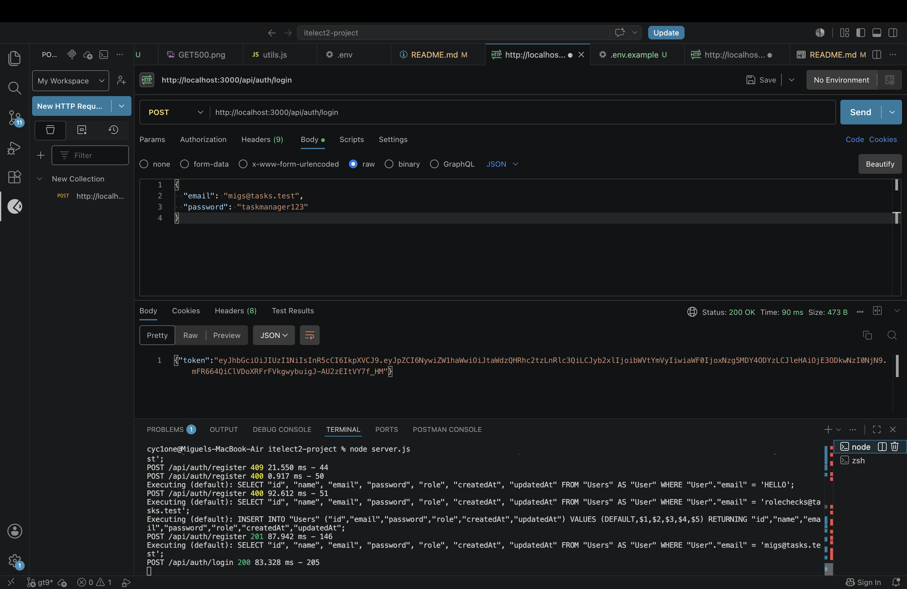
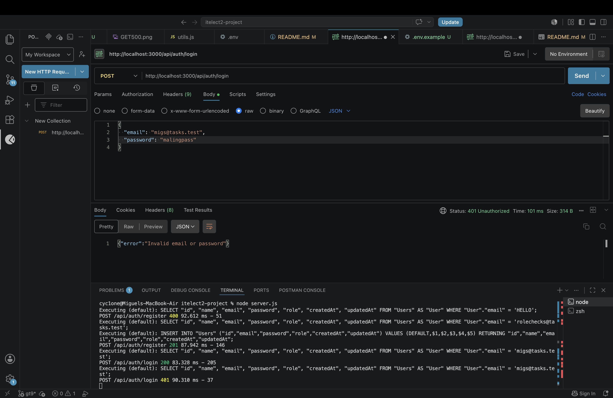
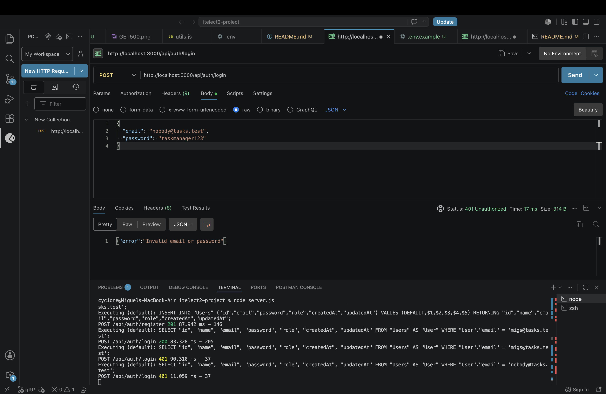
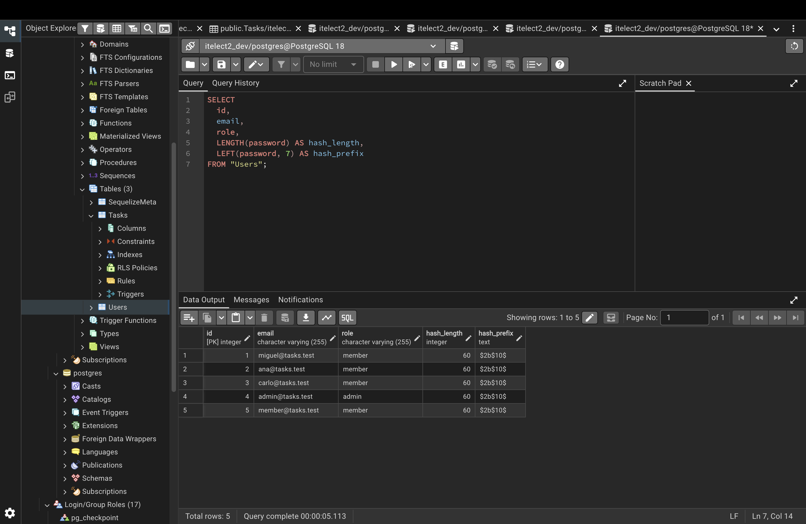
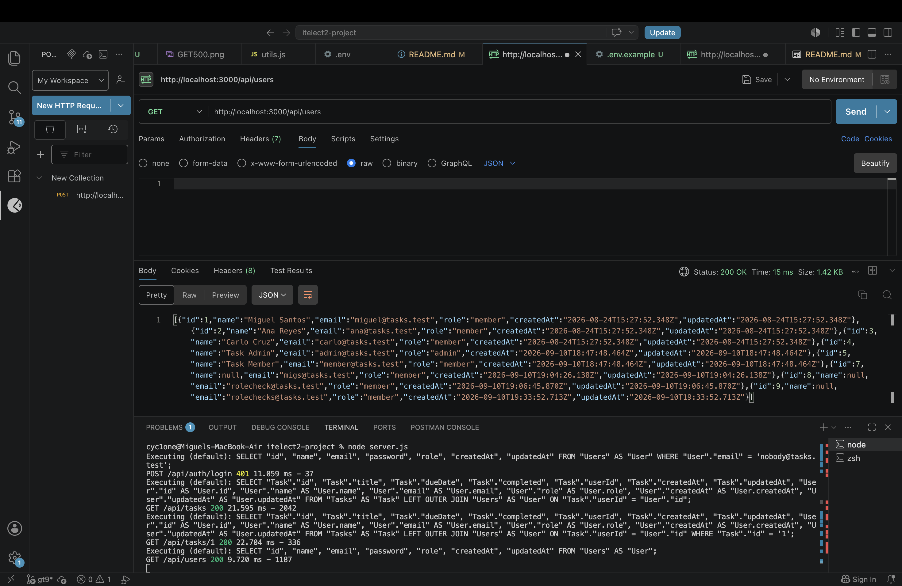

# itelect2-project
My IT Elective 2 backend web development project.

## API Testing

### GET Tasks
 

### POST Tasks
 

### PUT Tasks
 

### DELETE Tasks
 

## GT8 - PostgreSQL and Sequelize Testing

### GET Tasks with User (JOIN)

### GET One Task

### GET Task Not Found

### GET Users

### POST Task Created

### POST Task Validation Error

### PUT Task Updated

### POST Task Not Found

### DELETE Task

### DELETE Task Not Found

### PostgreSQL Tables

## GT9 - Password Hashing and JWT Login

### Successful Registration — 201

### Duplicate Email — 409

### Short Password — 400

### Invalid Email — 400

### Registration Ignores Admin Role

### Successful Login — 200

### Wrong Password — 401

### Unknown Email — 401

### Hashed Passwords and User Roles

### Tasks with Users Without Password Fields

